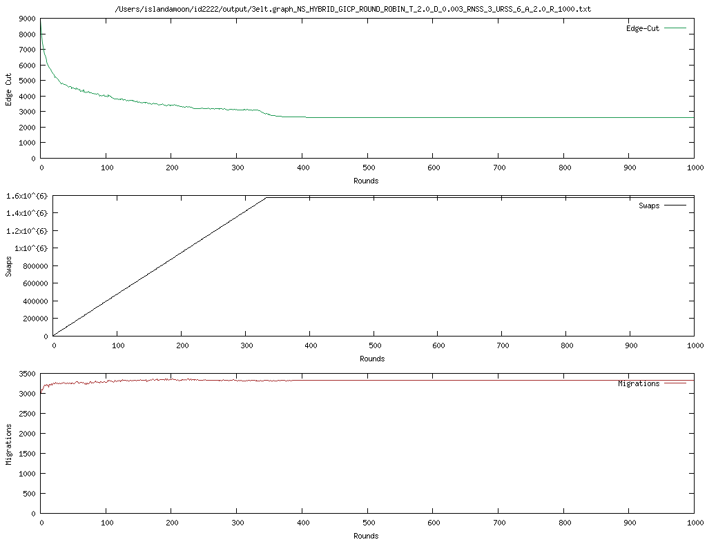

# Data Mining - Assignment 5

Group 51 Chenyang Ding & Yilai Chen

### 1. Implementation of Ja-Be-Ja

#### 1.1 `findPartner`

```java
public Node findPartner(int nodeId, Integer[] nodes) {
    ......
    for (Integer candidate : nodes) {
      Node nodeq = entireGraph.get(candidate);
      //before swap
      int degree_pp = getDegree(nodep, nodep.getColor());
      int degree_qq = getDegree(nodeq, nodeq.getColor());
      double old_weighted_d = Math.pow(degree_pp, config.getAlpha()) + Math.pow(degree_qq, config.getAlpha());
      // assume swap
      int degree_pq = getDegree(nodep, nodeq.getColor());
      int degree_qp = getDegree(nodeq, nodep.getColor());
      double new_weighted_d = Math.pow(degree_pq, config.getAlpha()) + Math.pow(degree_qp, config.getAlpha());
        
      if (annealing) {
        Random random = new Random();
        double prob = random.nextDouble();
        double ann_pro = cal_Ann_Pro(new_weighted_d, old_weighted_d);
        if (new_weighted_d != old_weighted_d && ann_pro > prob && ann_pro > highestBenefit) {
          bestPartner = nodeq;
          highestBenefit = ann_pro;
        }
      } else {
        if (new_weighted_d * T > old_weighted_d && new_weighted_d > highestBenefit) { //Judge by T and benefit
          bestPartner = nodeq;
          highestBenefit = new_weighted_d;
        }
      }
    }
    return bestPartner;
  }
```

First, the same color degree of the current node and the candidate node before and after the exchange is compared, and then a certain probability calculation formula is used to determine whether a suitable partner is found to exchange.

```java
private double cal_Ann_Pro(double new_d, double old_d){
    return Math.exp((new_d - old_d) / Math.pow(T, exponent_round));
  } // T high, P close to 1, tend to accept bad solutions
```

Even if `new_d` is worse than `old_d` (`new_d` - `old_d` < 0), it is still possible to accept the new solution.

When `T` is large, denominator tends to be large, `P` tends to be close to 1, so larger than `prob`.

#### 1.2 `sampleAndSwap`

```java
private void sampleAndSwap(int nodeId) {
    ......
    if (config.getNodeSelectionPolicy() == NodeSelectionPolicy.HYBRID
            || config.getNodeSelectionPolicy() == NodeSelectionPolicy.LOCAL) {
      // TODO swap with random neighbors
      partner = findPartner(nodeId, getNeighbors(nodep));
    }

    if (config.getNodeSelectionPolicy() == NodeSelectionPolicy.HYBRID
            || config.getNodeSelectionPolicy() == NodeSelectionPolicy.RANDOM){
      // TODO if local policy fails then randomly sample the entire graph
      if(partner == null) {
        partner = findPartner(nodeId, getSample(nodeId));
      }
    }
    // TODO swap the colors
    if (partner != null) {
      int tempColor = nodep.getColor();
      nodep.setColor(partner.getColor());
      partner.setColor(tempColor);
      numberOfSwaps++;
    }
  }
```

#### 1.3 `saCoolDown`

```java
private void saCoolDown(){
    // TODO for second task
    if (annealing){
      ......
    }
    else {
      if (T > 1)
        T -= config.getDelta();
      if (T < 1)
        T = 1;
    }
  }
```

- The temperature decreases gradually with each iteration.
- The speed of temperature decrease is controlled by `config.getDelta`(). The larger the delta, the faster the temperature decreases.
We implemented the Ja-Be-Ja algorithm, and test it on 3elt, add20, and Facebook/Twitter graphs, the visualization results are as follows:

<p style="text-align: center; font-size: 12px;">
    Figure 1: result of 3elt graph on origninal Ja-Be-Ja algorithm, runtime: 14353ms
</p>


<p style="text-align: center; font-size: 12px;">
    Figure 2: result of add20 graph on origninal Ja-Be-Ja algorithm, runtime: 8071ms
</p>


<p style="text-align: center; font-size: 12px;">
    Figure 3: result of facebook graph on origninal Ja-Be-Ja algorithm, runtime: 909557ms
</p>
The original Ja-Be-Ja algorithm uses a simple cooling method, where the temperature goes down gradually to help the algorithm find better solutions. It works well for small and simple graphs like 3elt, with fewer swaps and faster results. For medium graphs like add20, the performance is still okay but needs more swaps and time to complete. However, for large and complex graphs like Facebook, the algorithm struggles. It takes a lot more swaps and time to finish, showing that this method isn’t very efficient for big, dense graphs.

### 2. Effect of Simulated Annealing

```java
private int exponent_round = 0;
private int reset_rounds = 0;
private boolean annealing = true;
```

In the initial variable definition, added `exponent_round` to control the exponent adjustment of temperature in the acceptance probability calculation

- `exponent_round` is small (0): the effect of temperature on the acceptance probability is more direct, and annealing is faster.
- `exponent_round` is large: the effect of temperature is slowed down, the annealing speed is slower, and it is more inclined to accept "inferior solutions".
- As the number of rounds increases, the acceptance probability adjustment of the annealing process becomes more and more stringent.

```java
private void saCoolDown(){
    if (annealing){
      exponent_round++;
      T *= config.getDelta();
      if (T < Math.pow(10, -5)) T = (float) Math.pow(10, -5);
      if (T == Math.pow(10, -5)) {
        reset_rounds++;
        if (reset_rounds == 400) {
          T = 1;
          reset_rounds = 0;
          exponent_round = 0;
        }
      }
    }
    else {
      ......
    }
  }
```

<p style="text-align: center; font-size: 12px;">
    Figure 4: result of 3elt graph on task 2, runtime: 76575ms
</p>


<p style="text-align: center; font-size: 12px;">
    Figure 5: result of add20 graph on task 2, runtime: 29812ms
</p>


<p style="text-align: center; font-size: 12px;">
    Figure 6: result of facebook graph on task 2, runtime: 1667297ms
</p>
With dynamic cooling, the algorithm adjusts how quickly the temperature drops, which helps it explore better at the start and focus more on finding good solutions later. This change reduces the number of swaps needed, especially for dense graphs. It also improves how well the graph is divided, especially for simpler and medium graphs. For very complex graphs like Facebook, it still manages to improve the process by making the optimization more efficient and controlled.

### 3. Define acceptance probability function

This function, cal_Ann_Pro, dynamically calculates the acceptance probability for new solutions in the Ja-Be-Ja algorithm. It uses the difference between the new and old solution qualities and the current temperature  T, adjusted by the number of rounds (exponent_round), to control whether to accept a new solution.
Key behaviors:
- At High Temperatures:  T  is large,  P  approaches 1, allowing bad solutions to be accepted to escape local optima.
- At Low Temperatures:  T  decreases,  P  approaches 0, enforcing stricter selection criteria for better convergence.
- Dynamic Control: The temperature is adjusted exponentially, balancing exploration and exploitation as the algorithm progresses.
```java
private double cal_Ann_Pro(double new_d, double old_d){
    return Math.exp((new_d - old_d) / Math.pow(T, exponent_round));
} // T high, P close to 1, tend to accept bad solutions
```

<p style="text-align: center; font-size: 12px;">
    Figure 7: result of 3elt graph on bonus, runtime: 21763ms
</p>


<p style="text-align: center; font-size: 12px;">
    Figure 8: result of add20 graph on bonus, runtime: 10443ms
</p>


<p style="text-align: center; font-size: 12px;">
    Figure 9: result of facebook graph on bonus, runtime: 1181560ms
</p>

The custom acceptance method changes how the algorithm decides to accept a solution. It lets the algorithm explore freely at the start and gets stricter later on. This reduces unnecessary swaps and speeds up the process. The results for edge cuts are as good or better than before, and the process works well even for large graphs. This makes it a great improvement for handling complex graphs like Facebook, keeping the quality high while making the process faster and simpler.


<p style="text-align: center; font-size: 12px;">
    Figure 10: result of 3elt graph on bonus and NUM_PARTITIONS = 10
</p>


<p style="text-align: center; font-size: 12px;">
    Figure 11: result of add20 graph on bonus and NUM_PARTITIONS = 10
</p>
When NUM_PARTITIONS is set to 10, the Ja-Be-Ja algorithm works well on both the simple 3elt graph and the more complex add20 graph. The 3elt graph reaches stable edge-cut values faster, around 400 rounds, while the add20 graph takes longer, about 1000 rounds, because it is more complex. More partitions increase the number of swaps and migrations, especially for the complex graph, showing the higher computation needed. However, the final edge-cut results for both graphs are similar and stable, showing that the algorithm can adapt and perform well even with more challenging partition tasks.

